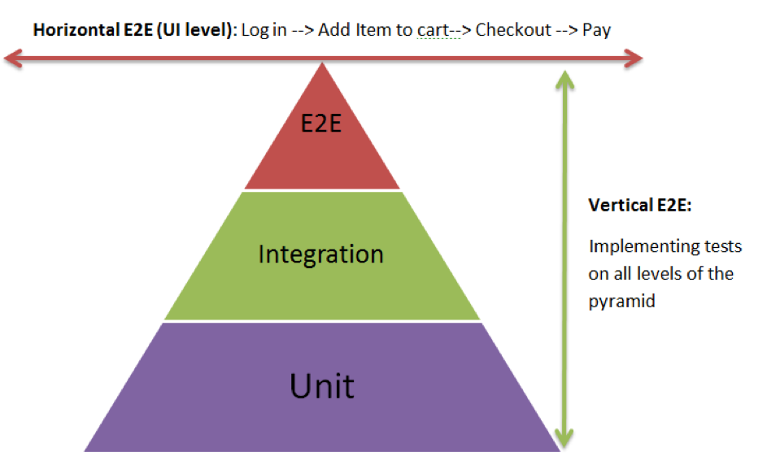

# Tests

## Unit Tests: 
Testing of individual functions or classes by supplying input and making sure the output is as expected. 

## Integration Tests
 Testing processes or components to behave as expected when combined, including the side effects. Test the correct 
 inter-operation of multiple subsystems. There is whole spectrum there, from testing integration between two modules, 
 to testing integration with the production environment.

## UI Tests (A.K.A Functional Tests) 
Testing scenarios on the product itself via browser, without taking into consideration the internal processes, 
to ensure expected behavior.

## Smoke Test (similar to Sanity Check)
 A simple integration test that checks that the system's critical functionality of the program is working fine.
 It's (also) used to save QA from wasting time on installing  and testing software that is unstable.
 Smoke testing is an analogy with plumbing, where pipes are filled by smoke and then checked visually. 
 If anything smokes, the system is leaky.

## Regression Test (aka Non-Regression Test)
 A test that was written  particularly for a bug fix and ensures that this bug will not happen again. 
 It can also be a test made prior to changing an application to ensure the application has the same output.

## Acceptance Test
 Ensures that a new feature is implemented correctly.
 Similar to an integration test, but focuses on the expected result rather than on the integration level of
 the components involved.

## System Test
 Tests a system in a black boxed environment. 
 Dependencies on other systems are often mocked (otherwise it would be more of an integration test). 
 It differs from Integration Test in the matter of it is testing on a complete, integrated system to evaluate 
 the system’s compliance with its specified requirements whether  
 Integration testing is a testing in which individual software modules are combined and tested as a group.
 
## Pre-flight Check
 Tests that are repeated in a production-like environment, to alleviate the 'works on my machine' issue. 
 Often this is realized by doing an acceptance or smoke test in a production like environment. 

## End-to-end Test
 This is more about the actual flow through a system in a more realistic end user scenario. 
 Can a user navigate the application as expected and does it work? 
 You're testing the workflow (where System tests test the whole system)

## A/B Test (aka Split Testing)
 Randomly redirect a percentage of clients to another version of the application, 
 gather data and generate statistics

## Process 
A development process example could be:
Build passed? -> Smoke Test passed? -> Acceptance Test passed? -> QA Tested? -> Production
